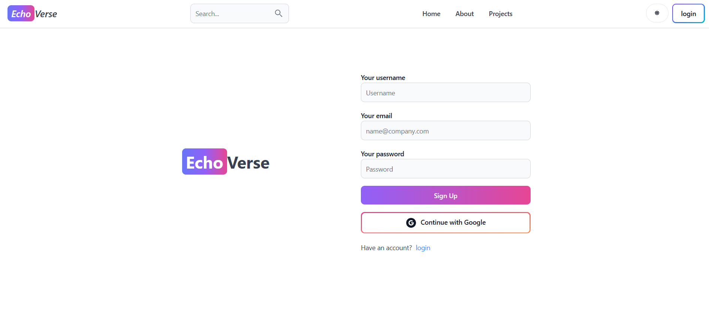
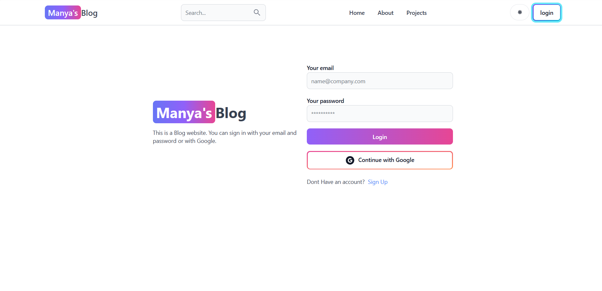
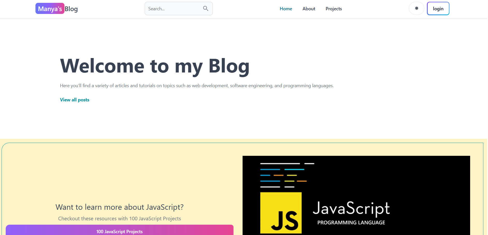
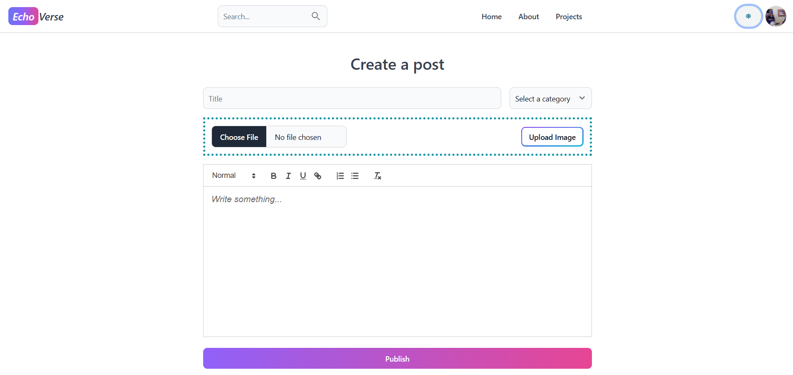
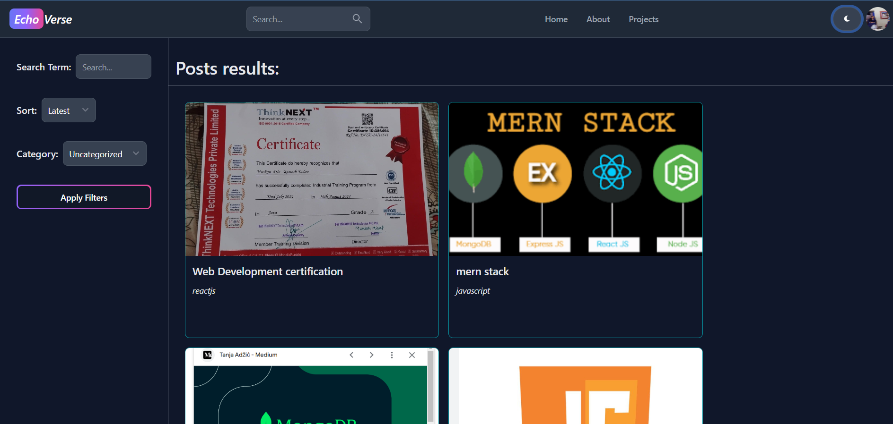
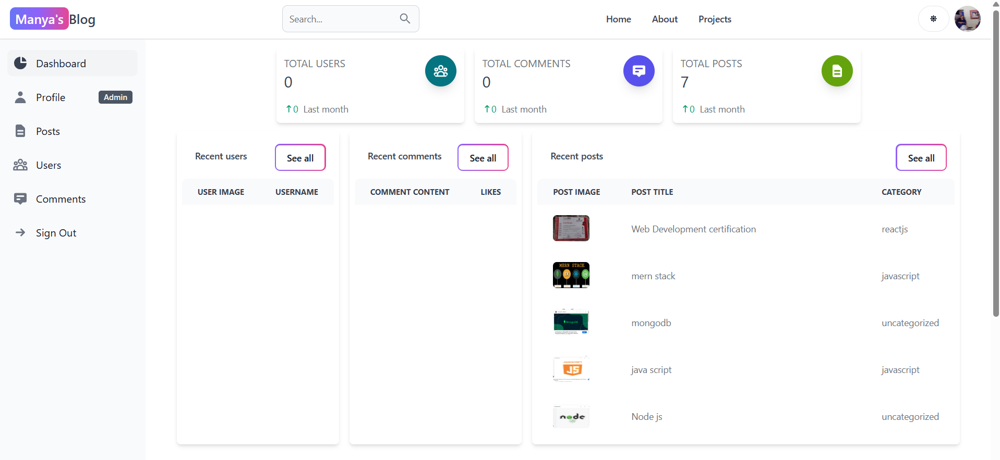

# ✍ Blog Website

A full-featured *Blog Website* built using the *MERN stack* (MongoDB, Express.js, React.js, Node.js) with *Firebase Authentication*. Users can sign up, log in, create and manage blog posts, and browse articles from other users. Admin functionality is included to manage content.

## 🚀 Features

- 🔐 Firebase Authentication (Email & Google login)
- 📝 Create, edit, and delete blog posts
- 🌐 View all published blogs
- 👤 User profile with published posts
- 🛠 Admin panel to manage blogs/users
- 📸 Image support for blog posts
- 🔎 Search and filter blogs by category or keyword
- 🧑‍🤝‍🧑 Role-based access (User/Admin)

## 🛠 Tech Stack

*Frontend:*
- React.js
- React Router
- Tailwind CSS 

*Backend:*
- Node.js
- Express.js
- MongoDB (Mongoose)

*Authentication:*
- Firebase Authentication (Email/Google)

## 📷 Screenshots

### 🔐 Blog Signup

### 🔑 Blog Login

### 🏠 Home Page

### 📝 Create Post

### 📖 Blog Page

### 🛠 Admin Dashboard

### 📂 Project Page Blog

